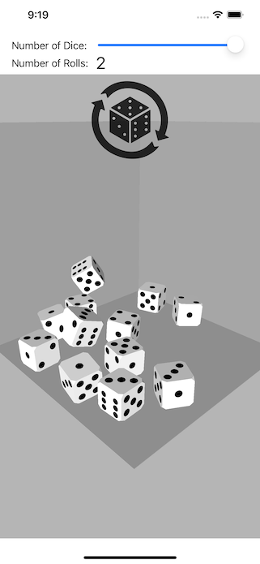

# WSUMVCDice

This is an example project built for Wright State University CS-3170 "Mobile App Development" in Spring 2023. The project demonstrates Model-View-Controller design.
 
- The Model is a 3D simulation of one to twelve six sided dice that can be "rolled" by applying random forces/impulses to the dice and letting a physics simulation determine the ending states of the dice. Note: the simulation works even if there is no display of the 3D dice. For example, the Model's physics simulation determines the ending states of the dice, and in some cases, those ending states are the only needed output.
- The View is a SceneKit View that displays the 3D dice as they are animated, reports the final states of the dice, allows control over the number of dice, reports the number of rolls, and enables re-rolling.
- The Controller serves as a 'glue' interface between the View and the Model. The Controller creates or loads the Model and creates or loads the View.

 

